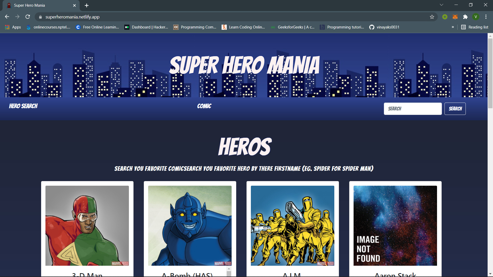

# Super Hero Mania ⚡

A web app that fetches data from Marvel API and provides you all the data about your favorite superhero (their all versions) and also helps to search marvel comics.🦸

## Live

The website is live at [superheromania.netlify.app](https://superheromania.netlify.app/). Please make sure to check out the website.

## Usage

The main usage is to provide you all the data about superheroes and comic books. you just have to navigate what you want to search hero or comics. here is a screenshot below to get a better idea.  



## Installation

After cloning the repo

Install all the dependencies.

```bash
npm i
```

Run the project locally

```bash
npm start
```
**Note**: You must have Node.js installed on your machine. It's essential to run a react project.

# Contributing

Pull requests are welcome. If you have any idea or suggestions or issues please **open an issue** first to discuss.